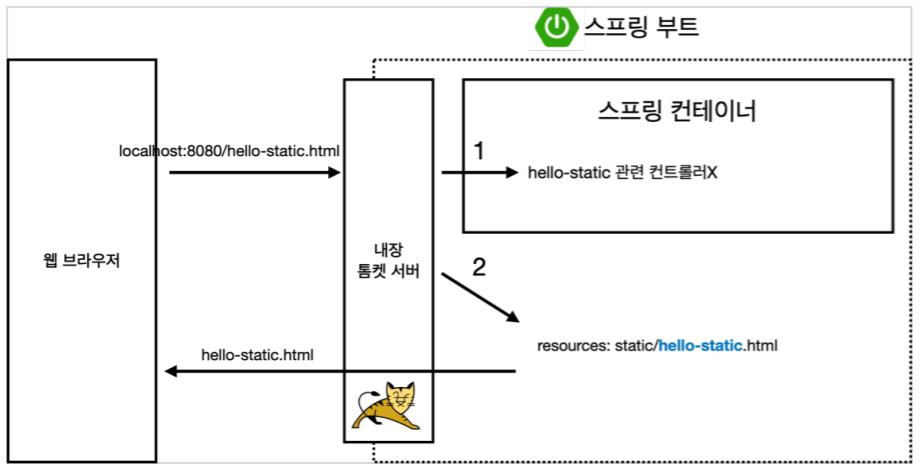
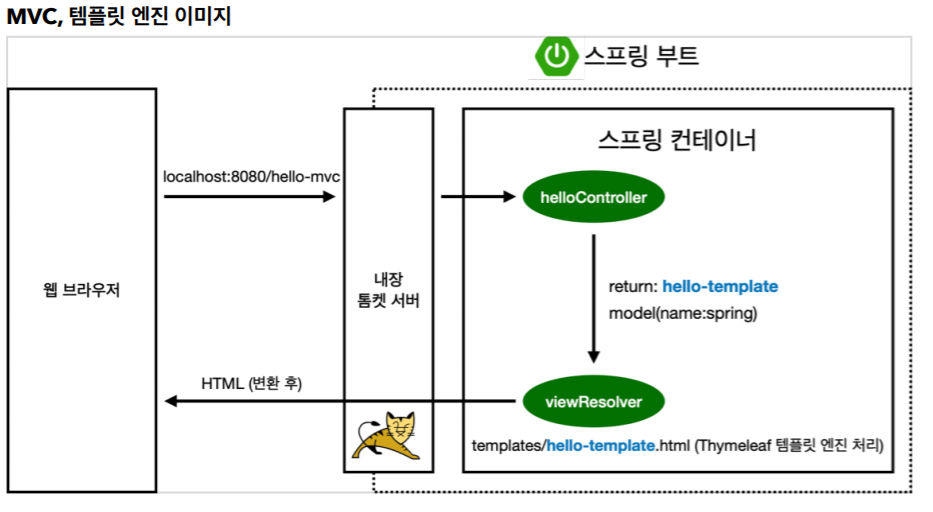
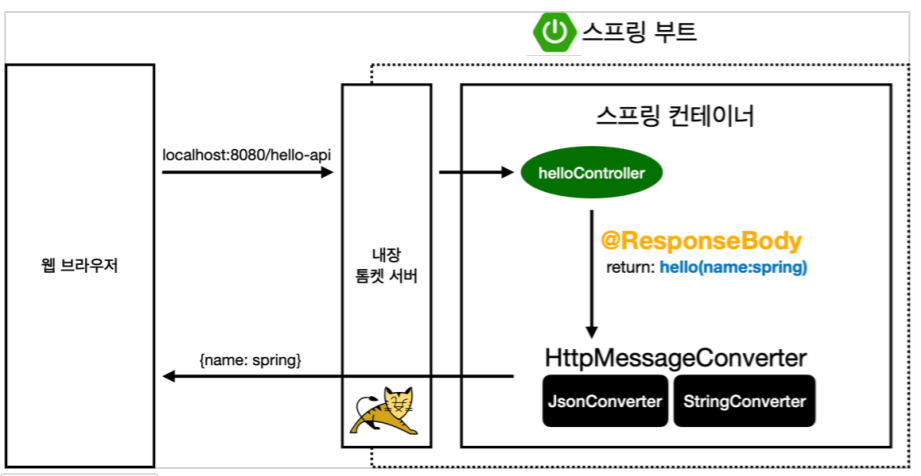
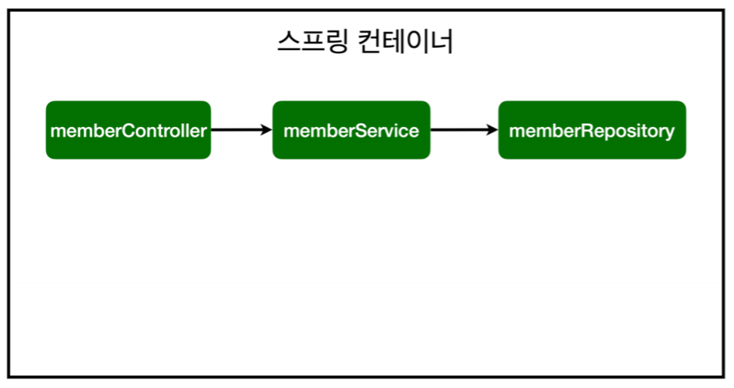
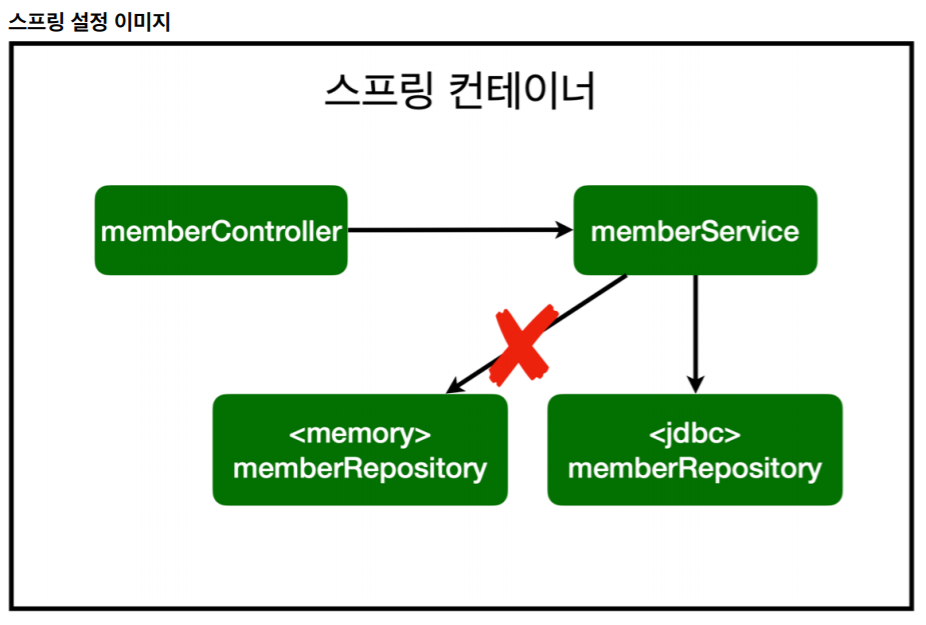

# spring-base

(우선 따라하며 이해하기)

- 스프링 입문 - 코드로 배우는 스프링 부트, 웹 MVC, DB 접근 기술

강의 주소 : [[스프링 입문]](https://www.inflearn.com/course/%EC%8A%A4%ED%94%84%EB%A7%81-%EC%9E%85%EB%AC%B8-%EC%8A%A4%ED%94%84%EB%A7%81%EB%B6%80%ED%8A%B8)

# Spring을 사용하는 이유

- 스프링은 자바 및 JVM 환경의 대체언어들의 효율적이고 쉬운 엔터프라이즈 애플리케이션 개발 환경을 제공한다.
- 스프링은 만들고자하는 애플리케이션의 요구사항과 목적에 따라 유연하게 적용시킬수 있다.
- 스프링은 직관적인 API를 제공한다.
- 깔끔한 코드 구조를 만들기위한 높은 기준이 설정되어 있다.
- 이전버전들과의 호환성이 강력하게 유지된다.

# gradle

- 버전을 설정하고 라이브러리를 가져오는 것 -> package.json 같은 것

# 검색

- 스프링이 가지고 있는 기능은 어마어마하기에 전부를 배우기보다 필요할 때 찾아쓰는 검색 능력이 중요하다.
  
검색 방법 : spring.io를 들어간다 -> projects -> Spring Boot -> learn -> 해당 버전의 Reference Doc. -> 필요한 내용을 찾는다(다 영어라 영어 공부 열심히 하자.)

- 공식 사이트를 자주 보자. (spring.io)

# Welcome Page

- 스프링 부트가 제공하는 기능
> 서버를 열면 src/main/resources/static/index.html을 표시해준다.

# 이미 사용 중인 포트라고 뜰 시
>cmd -> netstat -ano | findstr 8080 -> taskkill /F /pid <PID>

# 빌드하고 실행하기

- 콘솔로 이동

>1. ./gradlew build
>2. cd build/libs
>3. java -jar hello-spring-0.0.1-SNAPSHOT.jar
>4. 실행 확인

# 정적 컨텐츠 동작



- 웹 브라우저에서 내장 톰켓 서버로 요청을 하면 톰켓 서버는 먼저 스프링 컨테이너(현재 controller 폴더) 안을 먼저 찾아본다.
해당 파일이 없을 경우 resources/static 폴더 안에서 찾아서 그대로 보내주게 된다. (static 폴더 안에서는 확장명까지 정확하게 본다.)
  
# mvc, 템플릿 엔진 동작



- 기본적으로 mvc의 동작을 보여주는 예시이다. 
  웹브라우저에서 서버에 요청한다. 요청 받은 서버는 controller에서 맵핑된 것이 있는지 찾고 있으면
  데이터베이스(model)에서 정보를 가져와 서버에서 가공하여 viewResolver(템플릿 엔진)로 보내준다.
  템플릿 엔진(현재 사용중인 템플릿 엔진은 thymeleaf)은 서버에서 넘어온 데이터를 맞는 자리에 넣어주고 
  HTML로 변환시켜서 웹 브라우저로 넘겨준다.
  
# API 동작



- @ResponseBody : view로 보내는 것이 아니라 해당 데이터를 보낸다. 여러 타입으로 보낼 수 있으며
객체(오브젝트)는 현재 대부분 JSON 방식으로 넘겨준다.
  
- JSON : 키, 값으로 이루어진 오브젝트
```
{
"key":"value",
"key2":"value2"
}
```

# TestCase

- Java의 Main을 작성하는 것과 비슷한 것. 만든 기능들을 테스트해 보기위해 사용한다.

- test 폴더에서 클래스 안에 있는 테스트 할 메서드 위에 @Test를 붙여주면 메서스 실행이 가능하다.

- 메소드 명을 과감하게 한글이름으로 해도 좋다. 우선, 한국 사람끼리 개발하는 곳에서는 영어보다 직관적이며 빌드 시 테스트 코드는 들어가지 않기에 상관없다.

# TDD(Test-Driven Development)

- 테스트 주도 개발. 먼저 테스크 케이스를 작성해놓고 main을 개발하는 방식
  
- 개발의 역순. 
  - 구현클래스 -> 테스트케이스(X)
  - 테스트케이스 -> 구현클래스(O)

# Optional ifPresent(),get() 메소드

- ifPresent() : 해당 값이 있으면 {} 안의 내용을 실행

```
//ex
private final MemberRepository memberRepository = new MemoryMemberRepository();

memberRepository.findByName(member.getName())
        .ifPresent(m -> {
        throw new IllegalStateException("이미 존재하는 회웝입니다.");
        });
```

- get() : 값이 나옴.
  
(단, 바로 꺼내는 걸 권장하진 않고)

- orElseGet() : 꺼낼 값이 없는 경우 default값을 꺼내는 등 다양한 옵션이 있기에 이걸 많이 사용한다.

```
//ex
Member result = repository.findById(member.getId()).get();
```

# Service

- 구현한 기능을 사용한 비즈니스 소스에 가깝다. 고객의 요구사양(or 개발자의 요구사항)을 만족시키기 위해 조건, 반복 등 여러 제어문을 사용하여 구현하게 된다.

- 메소드의 이름을 비즈니스에 가깝게 짜는 것이 좋다. -> 이후에 소스를 수정하는데 있어서 효율적이다.
  (ex) 회원가입, 전체조회, 선택 조회 등)

# 스프링 빈과 의존관계

- 회원 컨트롤러가 회원서비스와 회원 레포지토리를 사용할 수 있게 의존관계를 설정

```java
package base.springbase.controller;

import base.springbase.service.MemberService;
import org.springframework.beans.factory.annotation.Autowired;
import org.springframework.stereotype.Controller;

@Controller
public class MemberController {
    private final MemberService memberService;

    //스프링 빈과 스프링 빈을 연결한다.
    @Autowired
    public MemberController(MemberService memberService) {
        this.memberService = memberService;
    }
}
```
- 생성자에 @Autowired가 있으면 스프링이 연관된 객체를 스프링 컨테이너에서 찾아서 넣어준다.
이렇게 객체 의존관계를 외부에서 넣어주는 것을 DI(Dependency Injection), 의존성 주입이라 한다.

- 이전 테스트에서는 개발자가 직접 주입했고, 여기서는 @Autowired에 의해 스프링에 주입해준다.

위와 같이만 작성할 경우, 에러가 발생하게 되는데 
```
Consider defining a bean of type 'base.springbase.service.MemberService' in your configuration.
```
**현재 MemberService 은 그저 .java 파일** 일뿐이다. 이것을 스프링 빈으로 등록 시켜줘야하며, 스프링 빈을 등록시키는 방법은 2가지가 있다.

## - 첫번째, 컴포넌트 스캔과 자동 의존관계 설정

먼저, SpringBaseApplication.java 를 보면 @SpringBootApplication 라는 Annotation 이 있는데, 
이 안을 둘러보면 @ComponentScan 을 볼 수 있다.

이 Annotation 을 통해 @Component 들을 스프링 빈에 등록할 수 있는데, 
@Component 를 포함하고 있는 Annotation 에는 @Controller, @Repository, @Service 등이 있다.

즉, MemberService.java 를 스프링 빈에 등록하기 위해 아래 코드와 같이 작성해줄 수 있다.
```java
@Service
public class MemberService {
    
    private final MemberRepository memberRepository;
    
    @Autowired
    public MemberService(MemberRepository memberRepository) {
        this.memberRepository = memberRepository;
    }
}
```
해당 소스에서 @Autowired 를 또 볼 수 있는데, 이는 MemberService 가
MemberRepository 를 의존하기에 둘을 연결하기 위해 사용된 것이다.
최종적으로, 세 개의 스프링 빈이 연결한 모습을 이미지로 보면

위와 같은 모습을 볼 수 있다.

- 스프링은 스프링 컨테이너에 스프링 빈을 등록할 때, 기본적으로 싱글톤으로 등록한다.(유일하게 하나만 등록해서 공유한다.)
따라서 같은 스프링 빈이면 모두 같은 인스턴스다.
  
- 스프링 컨테이너는 해당 폴더의 하위 폴더만 스캔한다.

- 기본 3 구성 역활
  - @controller : 외부 요청을 받음.
  - @Service : 비즈니스 로직을 만듬.
  - @Repository : 데이터를 저장.

## 두번째, 자바 코드로 직접 스프링 빈 등록하기

회원 서비스와 회원 리포지토리의 @Service, @Repository, @Autowired Annotation을 제거하고 진행한다.

```java
package base.springbase;

import base.springbase.repository.MemberRepository;
import base.springbase.repository.MemoryMemberRepository;
import base.springbase.service.MemberService;
import org.springframework.context.annotation.Bean;
import org.springframework.context.annotation.Configuration;

@Configuration
public class SpringConfig {

    @Bean
    public MemberService memberService(){
        return new MemberService(memberRepository());
    }

    @Bean
    public MemberRepository memberRepository(){
        return new MemoryMemberRepository();
    }
}
```

- 실무에서는 주로 정형화된 컨트롤러, 서비스, 리포지토리 같은 코드는 ComponentScan 을 사용한다.
그리고 정형화 되지 않거나, 상황에 따라 구현 클래스를 변경해야 하면 설정을 통해 스프링 빈으로 등록한다.

# 스프링 설정 이미지



- 개방-폐쇄 원칙(OCP, Open-Closed Principle)
  - 확장에는 열려있고, 수정, 변경에는 닫혀있다.
  
- 스프링의 DI(Dependencies Injection)을 사용하면 기존 코드를 전혀 손대지 않고, 설정만으로 구현 클래스를 변경할 수 있다.

# IntelliJ 단축키
- ctrl + shift + enter : 자동완성기능

```
Hello hello = new Hello(
//저 상태에서 누르면
Hello hello = new Hello();
```

- ctrl + p : 파라메타에 들어갈 수 있는 정보를 보여줌(api에 데이터를 넣을 때 유용함)

- alt + Insert : 클래스, 인터페이스, 패키지, getter or setter 등을 생성할 때 사용

- shift + F6 : rename (== vscode : ctrl + D)

- ctrl + alt + v : return 값 자동 완성

```
//사용 전
memberRepository.findByName(member.getName());
//사용 후
Optional<Member> byName = memberRepository.findByName(member.getName());

//자주 사용 됨.
```

- ctrl + alt + shift + T : 소스 리펙토링할 때 사용하는 단축키

- ctrl + shift + T : 해당 클래스의 테스트 케이스 생성

- shift + f10 : 이전에 실행했던 거 다시 실행